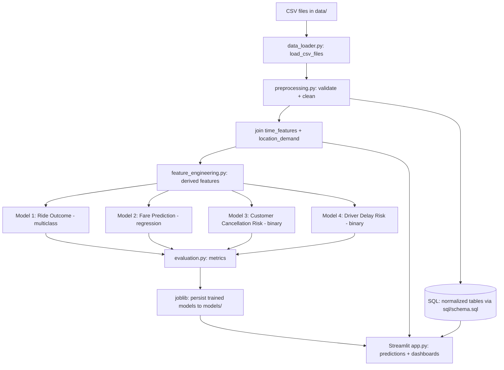

# Rapido: Intelligent Mobility Insights — Implementation Guide

This document translates `data/ProjectGuide.txt` (the generic capstone brief) into a concrete
implementation plan based on the **actual columns in the provided CSVs**. It covers the full
data flow, validation rules, feature/model logic, SQL design, and the Streamlit UI/UX plan.

> Read this alongside `ProjectGuide.txt`. Where the guide's language is generic ("distance",
> "fare", "traffic & weather"), this doc maps it to the real column names so nothing has to be
> guessed during implementation.

---

## 1. Business Objective (from ProjectGuide.txt)

Rapido wants a unified ML decision system that, using historical booking data, can:

1. Predict a booking's outcome before it completes (**Ride Outcome Prediction**).
2. Estimate the fare dynamically before confirmation (**Fare Prediction**).
3. Score customers for cancellation risk (**Customer Cancellation Risk**).
4. Score drivers for delay/incomplete-ride risk (**Driver Delay Prediction**).

These feed four business use cases: reduce cancellations 20%, improve ETA accuracy, dynamic
pricing, and driver reliability scoring — surfaced through a Streamlit dashboard.

---

## 2. Real Data Dictionary

### 2.1 `bookings.csv` (core transactional table)

| Column | Type | Notes |
|---|---|---|
| `booking_id` | string (`B_000001`) | Primary key |
| `booking_date` | date | |
| `booking_time` | time (`HH:MM:SS`) | Combine with `booking_date` → `booking_datetime` |
| `day_of_week` | categorical | Monday–Sunday |
| `is_weekend` | 0/1 | Redundant with `day_of_week`, keep as-is for convenience |
| `hour_of_day` | int 0–23 | |
| `city` | categorical | Mumbai, Chennai, Delhi, Bangalore, Hyderabad (confirm full set programmatically) |
| `pickup_location` / `drop_location` | categorical (`Loc_19`) | No lat/long — locations are anonymized IDs, unique **within** a city |
| `vehicle_type` | categorical | Bike, Auto, Cab |
| `ride_distance_km` | float | **This is "distance", not `distance_km`** |
| `estimated_ride_time_min` | float | Predicted ETA |
| `actual_ride_time_min` | float, nullable | Null when ride never completed (cancelled) |
| `traffic_level` | categorical | Low, Medium, High |
| `weather_condition` | categorical | e.g. Heavy Rain, Rain, Clear... |
| `base_fare` | float | |
| `surge_multiplier` | float | |
| `booking_value` | float | **This is the fare target — not `fare_amount`** |
| `booking_status` | categorical | Completed / Cancelled / Incomplete (**3-class target**) |
| `incomplete_ride_reason` | string, nullable | Populated only when status = Incomplete |
| `customer_id` / `driver_id` | string (`C_...` / `D_...`) | Foreign keys into customers/drivers |

### 2.2 `customers.csv`

`customer_id, customer_gender, customer_age, customer_city, customer_signup_days_ago,
preferred_vehicle_type, total_bookings, completed_rides, cancelled_rides, incomplete_rides,
cancellation_rate, avg_customer_rating, customer_cancel_flag`

- `cancellation_rate` and `customer_cancel_flag` are **pre-aggregated historical signals** — ideal
  inputs for the Customer Cancellation Risk model, but must be handled carefully (see §4 leakage note).

### 2.3 `drivers.csv`

`driver_id, driver_age, driver_city, vehicle_type, driver_experience_years, total_assigned_rides,
accepted_rides, incomplete_rides, delay_count, acceptance_rate, delay_rate, avg_driver_rating,
avg_pickup_delay_min, driver_delay_flag`

- `acceptance_rate`, `delay_rate`, `avg_pickup_delay_min` map directly to the guide's
  "Driver_Reliability_Score" concept.

### 2.4 `location_demand.csv` (pre-aggregated, not row-per-booking)

`city, pickup_location, hour_of_day, vehicle_type, total_requests, completed_rides,
cancelled_rides, avg_wait_time_min, avg_surge_multiplier, demand_level`

- Grain: one row per (city, pickup_location, hour_of_day, vehicle_type). Used for demand/EDA
  visuals and as a join-in feature (expected wait/surge at a given pickup point + hour), not for
  per-booking modeling directly.

### 2.5 `time_features.csv` (calendar/time dimension table)

`datetime, hour_of_day, day_of_week, is_weekend, is_holiday, peak_time_flag, season`

- Hourly grain for all of 2025. Joins onto bookings via `booking_date + hour_of_day` to bring in
  `is_holiday`, `peak_time_flag`, `season` — these are **not present in `bookings.csv` itself**.

### 2.6 Known gaps vs. the guide

- **No `payment_method` column anywhere** — the guide's "Payment method usage patterns" EDA
  bullet cannot be produced from this dataset. Document this as a known limitation in the README,
  don't fabricate a column.
- **No GPS coordinates** — heatmaps must be done by `city` / `pickup_location` category, not
  literal geographic maps.

---

## 3. End-to-End Data Flow



**Pipeline stages** (`src/pipeline.py` orchestrates all of this):

1. **Load** — `data_loader.py` reads all 5 CSVs into DataFrames.
2. **Validate** — schema/range/referential checks (§4) run before any cleaning changes shape.
3. **Clean** — `preprocessing.py` fixes nulls, parses datetimes, standardizes categoricals.
4. **Enrich** — join `time_features` (on date+hour) and optionally `location_demand` aggregates.
5. **Feature-engineer** — `feature_engineering.py` derives the guide's requested features (§5).
6. **Train/Tune** — `modeling.py` splits 80/20, trains 4 models, tunes via GridSearchCV.
7. **Evaluate** — `evaluation.py` computes accuracy/F1/AUC/confusion matrix (classification) and
   RMSE/MAE/R² (regression) against the benchmarks in the guide (85–90% accuracy, RMSE within
   ±10% of fare).
8. **Persist** — trained models + encoders saved with `joblib` to `models/`.
9. **Serve** — `app.py` loads persisted models and the cleaned data for interactive prediction and
   dashboards.

---

## 4. Data Validation Rules

Validation should run **before** cleaning/imputation so bad data is caught, not silently masked.

### 4.1 Structural checks (per file)
- All expected columns present; fail loudly (not silently) if a required column is missing.
- Primary keys unique: `booking_id`, `customer_id`, `driver_id`.
- Dtypes coercible: numeric columns parse as numeric, `booking_date`/`booking_time` parse as
  date/time, categorical columns are non-null strings.

### 4.2 Referential integrity
- Every `bookings.customer_id` exists in `customers.customer_id`.
- Every `bookings.driver_id` exists in `drivers.driver_id`.
- Log/report orphaned rows rather than silently dropping them.

### 4.3 Range / domain checks
- `ride_distance_km >= 0`, `base_fare >= 0`, `booking_value >= 0`, `surge_multiplier >= 1.0`.
- `hour_of_day` in `[0, 23]`.
- `cancellation_rate`, `acceptance_rate`, `delay_rate` in `[0, 1]`.
- `avg_customer_rating`, `avg_driver_rating` in `[1, 5]`.
- Categorical columns (`city`, `vehicle_type`, `traffic_level`, `weather_condition`,
  `booking_status`) restricted to their observed value sets — flag unseen categories rather than
  crashing.

### 4.4 Business-rule / cross-field consistency
- `completed_rides + cancelled_rides + incomplete_rides == total_bookings` (customers) and
  `== total_assigned_rides` (drivers, using accepted/incomplete/delay fields appropriately).
- `actual_ride_time_min` should be null **iff** `booking_status != "Completed"` — flag violations.
- `incomplete_ride_reason` populated **iff** `booking_status == "Incomplete"`.
- `booking_value >= base_fare` when `surge_multiplier >= 1` (sanity check, not a hard fail).

### 4.5 Missing-value strategy
- Numeric: median imputation **per relevant group** where possible (e.g. median `actual_ride_time_min`
  by `city` + `vehicle_type`) rather than a single global median — the existing scaffold's
  `clean_bookings` uses a flat global median, which is a reasonable v1 but should be revisited.
- `actual_ride_time_min` nulls on cancelled/incomplete rides are **expected, not missing data** —
  don't impute these; instead engineer a flag (`ride_completed_flag`) and exclude from
  duration-based features when null.
- Categorical nulls → `"Unknown"` (already implemented) is acceptable for low-cardinality safety.

---

## 5. Feature Engineering — Guide Requirement → Real Column Mapping

| Guide feature | Formula using real columns |
|---|---|
| `Fare_per_KM` | `booking_value / ride_distance_km` (guard divide-by-zero) |
| `Fare_per_Min` | `booking_value / actual_ride_time_min` (only where completed) |
| `Rush_Hour_Flag` | `hour_of_day` in `{7,8,9,17,18,19}` (or join `time_features.peak_time_flag` directly — **prefer the provided flag** over recomputing) |
| `Long_Distance_Flag` | `ride_distance_km >= 10` (threshold configurable) |
| `City_Pair` | `pickup_location + "_to_" + drop_location`, scoped within `city` since location IDs repeat across cities |
| `Driver_Reliability_Score` | already largely available as `drivers.acceptance_rate`, inverse of `delay_rate`, and `avg_driver_rating` — combine into a single weighted score, e.g. `0.4*acceptance_rate + 0.4*(1-delay_rate) + 0.2*(avg_driver_rating/5)` |
| `Customer_Loyalty_Score` | combine `customers.customer_signup_days_ago`, `total_bookings`, `avg_customer_rating`, inverse `cancellation_rate` similarly |

Additional derived features worth adding (not explicitly named in the guide but implied):
- `ride_completed_flag`, `is_cancelled_flag`, `is_incomplete_flag` (one-hot of `booking_status` for use as regression/EDA helpers, **never as a feature for the Ride Outcome classifier itself** — that would leak the target).
- `booking_datetime` = combine `booking_date` + `booking_time` for time-series/EDA plots.
- Join `time_features.is_holiday`, `season`, `peak_time_flag` onto bookings via date+hour.

### 5.1 Leakage warnings (important — guide doesn't call this out explicitly)
- For the **Ride Outcome model**, exclude `actual_ride_time_min` and `incomplete_ride_reason` as
  predictors — both are only known *after* the outcome, so including them would leak the target.
- For the **Customer Cancellation Risk model**, if predicting risk for a *specific upcoming
  booking*, don't include that booking's own outcome-derived aggregates recomputed *after* the
  event; use the customer's **prior** cumulative stats. Since `customers.csv` stats appear to be
  lifetime aggregates rather than point-in-time, treat this model as customer-level risk scoring
  (not per-booking) unless a time-ordered rebuild of rolling stats is done.
- Same caution applies to the **Driver Delay model** using `drivers.csv` aggregates.

---

## 6. Modeling Plan

### 6.1 Model types explained — what they mean and why each was picked

There are three distinct "shapes" of prediction problem in this project. The shape determines
what the model outputs, how it's trained, and how it's evaluated — so it's worth being precise
about which model is which before writing any training code.

**Binary classification** — the target has exactly **2 possible values** (e.g. will this
customer cancel: yes/no → `1`/`0`). The model doesn't just spit out "yes" or "no" — internally it
predicts a **probability** between 0 and 1 (e.g. "0.73 probability of cancelling"), and that
probability is thresholded (commonly at 0.5) to get a hard label. Keeping the raw probability
around matters here: it's what lets you build a *risk score* ("this customer is high risk") rather
than just a flat label, and it lets the business tune the threshold — e.g. lowering it to 0.3 to
flag more at-risk customers, accepting more false alarms because missing a real cancellation is
costlier than a wasted retention nudge.
- Used for: **Customer Cancellation Risk** (`customer_cancel_flag`, 0/1) and **Driver Delay Risk**
  (`driver_delay_flag`, 0/1). Both are naturally yes/no questions about a single entity.

**Multi-class classification** — the target has **3 or more discrete categories** with no
inherent order (Completed / Cancelled / Incomplete). The model predicts a probability for *each*
class (they sum to 1) and the predicted label is whichever class has the highest probability
(`argmax`). This is different from running three separate binary models — a single multi-class
model learns the classes jointly and guarantees the probabilities are comparable across classes.
- Used for: **Ride Outcome Prediction** (`booking_status`). It's 3 classes, not 2, so this can't
  be binary classification — that's the deciding factor.

**Regression** — the target is a **continuous number**, not a category (₹51.03, ₹465.85, etc.).
There's no "class" to predict; the model outputs a real number directly, and "close" answers are
partially credited (predicting ₹460 for an actual ₹465.85 fare is a much smaller error than
predicting ₹50), unlike classification where a prediction is simply right or wrong.
- Used for: **Fare Prediction** (`booking_value`). Fare is a price, so it's regression by
  definition — never model it as classification (e.g. "cheap/medium/expensive" buckets) unless the
  business explicitly asks for fare *bands* instead of an exact estimate.

**Why this distinction matters operationally, per model:**

| Model | Shape | Business action the output drives |
|---|---|---|
| Ride Outcome | Multi-class | If P(Cancelled) or P(Incomplete) is high pre-trip, ops can proactively reassign a driver or alert the customer before the ride starts. |
| Fare Prediction | Regression | Shown to the customer as the upfront estimated price before they confirm the booking; feeds dynamic pricing. |
| Customer Cancellation Risk | Binary | Customers above the risk threshold get targeted retention (priority matching, incentives) at booking time. |
| Driver Delay Risk | Binary | Drivers above the risk threshold get flagged for coaching, closer monitoring, or de-prioritized dispatch for time-sensitive rides. |

### 6.2 Model-to-algorithm mapping

| Model | Type | Target | Key features | Algorithm | Tuning |
|---|---|---|---|---|---|
| Ride Outcome | Multi-class classification | `booking_status` | city, vehicle_type, hour_of_day, traffic_level, weather_condition, surge_multiplier, ride_distance_km, rush/peak flags, city_pair | RandomForest / GradientBoosting (baseline), compare against LightGBM if available | GridSearchCV/Optuna over depth, n_estimators |
| Fare Prediction | Regression | `booking_value` | ride_distance_km, estimated_ride_time_min, vehicle_type, traffic_level, weather_condition, surge_multiplier, city, rush_hour_flag | RandomForestRegressor / GradientBoostingRegressor | GridSearchCV over depth, n_estimators, learning_rate |
| Customer Cancellation Risk | Binary classification | `customer_cancel_flag` | cancellation_rate, avg_customer_rating, total_bookings, preferred_vehicle_type, customer_signup_days_ago | Logistic Regression (interpretable baseline) + RandomForest | GridSearchCV, class-weight balancing (check class imbalance first) |
| Driver Delay Risk | Binary classification | `driver_delay_flag` | acceptance_rate, delay_rate, avg_pickup_delay_min, driver_experience_years, avg_driver_rating | Logistic Regression + RandomForest | GridSearchCV, class-weight balancing |

Why Logistic Regression is listed first for the two binary models: it outputs a probability
natively and its coefficients are directly interpretable ("a 1-point rating drop raises
cancellation odds by X%"), which matters for a business audience. RandomForest is added second to
capture non-linear interactions Logistic Regression would miss, at the cost of interpretability.

### 6.2.1 What each algorithm actually does (plain English)

**Logistic Regression** — think of a bank loan officer's scorecard. Every factor (rating,
cancellation history, etc.) gets a weight based on how much it has historically mattered. Add up
each customer's weighted points, run the total through a formula that squashes it into a 0–1
probability. It's simple, fast, and you can literally point to a number and say "this factor added
this much to the risk score" — that's why it's the interpretable baseline for the two binary
models.

**Decision Tree** (the building block behind the next two algorithms) — a flowchart of yes/no
questions: "Is distance > 10km?" → "Is traffic High?" → "Is it night time?" → arrive at an answer.
Easy to draw and explain, but one flowchart built from one dataset tends to memorize that
dataset's quirks rather than learning the general pattern — on its own it's not very reliable.

**Random Forest** — instead of trusting one flowchart, build hundreds of slightly different ones
(each is shown a random slice of the rows and a random slice of the clues), then let them vote.
For a category (Completed/Cancelled/Incomplete), the majority answer wins; for a number (fare),
average all the trees' guesses. It's like polling hundreds of independent analysts instead of
asking just one — individual mistakes cancel out, making it far more robust than a single tree
while still training reasonably fast. This is why it's used for Ride Outcome (multi-class) and
Fare Prediction (regression), and as the "second opinion" for both binary risk models.

**Gradient Boosting** — also builds many small trees, but one at a time, in sequence, where each
new tree is trained specifically to correct the mistakes the previous trees made ("predictions are
consistently too low for long night rides — focus on fixing that"). It typically squeezes out more
accuracy than Random Forest, but because each tree depends on the one before it, training is
slower and more sensitive to its tuning knobs (learning rate, tree depth) — push those too far and
it starts memorizing noise instead of the pattern. Listed as an alternative to try for Ride
Outcome and Fare Prediction if Random Forest's accuracy falls short of the guide's benchmark.

**GridSearchCV / Optuna** (the tuning step) — every model has "knobs": how many trees to build,
how deep each tree can go, how fast it learns. GridSearchCV is the brute-force approach: give it a
list of values for each knob and it tries every combination, keeping whichever scored best — exact
but slow once you have many knobs or many values per knob. Optuna is the smarter approach: it
tries a setting, checks how well it scored, and uses that result to make an educated guess about
which setting to try next — instead of blindly trying every combination, so it usually lands on a
strong setting in fewer attempts.

**Rule of thumb for this project**: start with the simplest, most interpretable option (Logistic
Regression for the binary models) as a baseline. Only move to Random Forest/Gradient Boosting if
it measurably beats that baseline on the guide's target metrics — added complexity has to earn its
keep, not be used by default.

### 6.3 Practical training notes

- Split: 80/20 train/test, `random_state=42` (already in `src/config.py`), stratify classification
  splits on the target — **stratification matters most for the two binary models**, since
  `customer_cancel_flag` and `driver_delay_flag` are likely imbalanced (far more 0s than 1s); an
  un-stratified split risks a test set with too few positive cases to evaluate reliably.
- Encode categoricals: one-hot for low-cardinality (`vehicle_type`, `traffic_level`, `city`),
  target/frequency encoding for high-cardinality (`pickup_location`, `drop_location`, `city_pair`).
- Evaluation targets from the guide: classification accuracy 85–90%, regression RMSE within ±10%
  of actual fare — report these explicitly in `evaluation.py` output, not just raw metric values.
- Evaluation metrics differ by shape: classification (all 3 models) uses accuracy/F1/AUC/confusion
  matrix; regression (Fare Prediction) uses RMSE/MAE/R² instead — these metric families aren't
  interchangeable, so `evaluation.py` needs separate functions per shape (already the case:
  `evaluate_classification` vs `evaluate_regression`).

### 6.4 What actually happened when this was built — the Ride Outcome ceiling

This section documents an empirical investigation worth keeping, not just a plan: the first
trained Ride Outcome model badly underperformed, and the fix (and remaining limitation) matter for
anyone extending this project.

**First attempt (trip-only features, `class_weight="balanced"`, `f1_weighted` scoring): 59.2%
accuracy.** That's *worse* than the trivial "always predict Completed" baseline (68.3%, since
Completed is 68% of all bookings). Balancing class weights trades overall accuracy for
minority-class recall — a defensible choice in general, but not when the guide's explicit benchmark
is raw accuracy (85–90%). Fix: drop `class_weight="balanced"` for this model and score GridSearchCV
on `"accuracy"` directly (see `src/modeling.py::train_ride_outcome_model`) — f1_macro is still
reported so the fairness trade-off stays visible, it's just no longer what's being optimized.

**Second attempt (trip-only features, unweighted): 68.0% accuracy** — statistically indistinguishable
from the majority-class baseline. Diagnosis: `traffic_level`, `weather_condition`, and especially
`surge_multiplier` *do* correlate strongly with Completed vs. Cancelled (e.g. completion rate is
90% at surge ≈1.0 vs. ~55% at surge ≈2.3), but none of them meaningfully separate out the
`Incomplete` class (~8% of bookings) — the model ends up never predicting it at all (0% recall).

**Third attempt — added customer/driver historical signals: 72.4% accuracy.** Joining each
booking's `customers.cancellation_rate`/`avg_customer_rating` and
`drivers.delay_rate`/`acceptance_rate`/`avg_driver_rating` onto the booking row (see
`feature_engineering.add_customer_driver_signals`) improved accuracy by ~4.5 points, and those
joined columns became the top-2 and top-4 most important features. This is **not target leakage**:
these are lifetime aggregates computed across a customer/driver's other bookings, not derived from
this specific booking's own outcome — it's the same kind of "does this customer usually cancel"
signal the guide's own Customer Cancellation Risk model is built around, just reused here. This is
now the shipped design (`RIDE_OUTCOME_NUMERIC` in `src/config.py` includes these 5 columns), and
the Trip Predictor page exposes them as sliders (with dataset-average defaults) so a user can
simulate "a high-cancellation customer paired with an unreliable driver."

**Remaining limitation, stated plainly:** 72.4% is still below the guide's 85–90% benchmark, and
`Incomplete` remains the hardest class to predict (near-zero recall even after the fix). Given that
even a customer/driver-aware model plateaus here, the dataset's outcome labels appear to have a
real stochastic component that isn't explainable by any of the provided columns — plausibly by
design, since `incomplete_ride_reason` values ("App Issue", "Vehicle Issue", "Customer No-show")
describe one-off events rather than conditions that should be predictable in advance. Document this
limitation in the dashboard/report rather than chasing the benchmark with an overfit model —
an honest below-benchmark result with a clear explanation is more defensible than a fabricated one.

---

## 7. SQL Layer

`sql/schema.sql` is now rebuilt to mirror §2's real columns, normalized as:

- `bookings` (fact table, FKs to customers/drivers)
- `customers` (dimension, includes the pre-aggregated behavior columns)
- `drivers` (dimension, includes reliability columns)
- `locations` (new: `city`, `pickup_location`/`drop_location` as a lookup dimension, since these
  repeat heavily — normalizes what's currently a raw string pair)
- `time_features` (dimension table for hourly calendar joins)

Indexes on `customer_id`, `driver_id`, `booking_date`, and `city` support the dashboard's filter
queries.

---

## 8. Streamlit UI/UX Design

### 8.1 Navigation structure (multi-page, sidebar filters global)

As built (`app.py` + `src/dashboard/`), the Ride Outcome Predictor and Fare Estimator were merged
into one **Trip Predictor** page sharing a single trip-scenario form — both models draw from
overlapping booking-level inputs, so one form avoids asking the user to enter the same hypothetical
trip twice, and it's more useful to see both predictions for the same scenario side by side. A
**Data Quality** page was also added to surface the §4 validation report:

```
Sidebar (persistent filters, only on Overview/EDA): city, date range, vehicle_type, booking_status
├── 1. Overview        — KPI tiles: total bookings, completion rate, cancellation rate, avg fare
├── 2. EDA & Trends     — guide's required exploratory visuals (§8.2)
├── 3. Trip Predictor   — one shared form → Ride Outcome probabilities + Fare estimate together
├── 4. Risk Scoring     — customer cancellation risk & driver delay risk lookup/table
├── 5. Model Monitoring — metric cards per model, confusion matrix, feature importance, retrain button
└── 6. Data Quality     — the §4 validation report (structural/referential/range/business-rule checks)
```

### 8.2 EDA visuals (directly from the guide, mapped to real columns)

- Ride volume by hour/weekday/city → bar/line chart on `hour_of_day`, `day_of_week`, `city`.
- Cancellation heatmap across cities → pivot `city` × `hour_of_day` on cancellation rate (category
  heatmap, since there's no lat/long).
- Distance vs Fare correlation → scatter `ride_distance_km` vs `booking_value`, colored by
  `vehicle_type`.
- Rating distribution → histograms of `avg_customer_rating` / `avg_driver_rating`.
- Customer vs Driver behavior comparison → side-by-side cancellation/delay rate comparison.
- ~~Payment method usage~~ → **not producible**, replace with "Vehicle type usage patterns" or
  flag as unavailable in the UI copy (be explicit, don't fake it).
- Traffic/Weather vs Cancellation → grouped bar of cancellation rate by `traffic_level` ×
  `weather_condition`.

### 8.3 UX principles (per the guide's Streamlit standards)
- Minimalist layout: `st.tabs` or sidebar radio for navigation, not a wall of charts on one page.
- All filters live in the sidebar and apply globally via `st.session_state` so switching pages
  doesn't reset context.
- Cache expensive steps: `@st.cache_data` for CSV loads/joins, `@st.cache_resource` for trained
  models — avoids reloading on every widget interaction.
- Prediction pages should show **input validation feedback** (e.g. distance can't be negative)
  before calling the model, and show prediction confidence/probability, not just a bare label.
- Use Plotly (already in requirements) for interactive charts so users can hover/zoom, consistent
  with "interactive dashboard" requirement.

---

## 9. Implementation Status

Everything in this guide has been built. What changed from the original scaffold:

- `data_loader.py` — unchanged (it was already a generic, correct file loader).
- `validation.py` — new; implements §4's checks and returns a flat report (surfaced on the
  dashboard's Data Quality page).
- `preprocessing.py` — rewritten to the real columns; preserves intentional nulls
  (`actual_ride_time_min` on non-completed rides) instead of imputing them away.
- `feature_engineering.py` — rewritten per §5, plus the season join and the customer/driver
  historical-reliability join added in §6.4.
- `modeling.py` — the 4 models in §6.2, each a single sklearn Pipeline (`ColumnTransformer` +
  estimator) so callers never duplicate encoding logic.
- `evaluation.py` — adds AUC and confusion matrix for classification, plus a benchmark-check flag
  on both classification and regression metrics.
- `db.py` (new) + `sql/schema.sql` — normalized schema per §7; SQLite by default via SQLAlchemy.
- `train.py` (new) — the end-to-end training/evaluation/persistence script (`python -m src.train`).
- `pipeline.py` — repurposed as the lighter data-prep path the dashboard uses (no training).
- `dashboard/` (new package) + `app.py` — the multi-page Streamlit app per §8.

See `README.md` for setup/run instructions and known data limitations (§2.6, §6.4).
